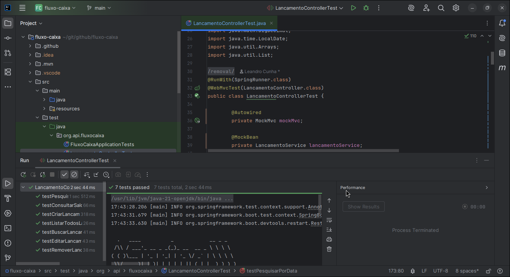

# Lançamentos API - Spring Boot

[](https://github.com/leandrocunha526/fluxo-caixa/actions/workflows/maven.yml)

## Sobre

Controle de fluxo de caixa diário, com lançamentos de débitos e créditos. Além da possibilidade de consultar o saldo consolidado por dia, por meio de um endpoint que retorne os dados e em formato JSON.

## Requerimentos

Desenvolvido com:

- [MySQL](https://www.oracle.com/br/mysql/what-is-mysql/) (e seria possível usar com MariaDB também fazendo as alterações necessárias. Mas a dependência para MariaDB via Maven já foi adicionada.)
- Java JDK 21 (LTS)
- Maven (MVN)
- Docker
- IDE Intellij IDEA Ultimate
- ORM: JPA (Java Persistence API)
- Framework: Spring Boot 3.4.5. See [Spring Boot 3.4.5 available now in April 24, 2025 by Andy Wilkinson](https://spring.io/blog/2025/04/24/spring-boot-3-4-5-available-now)
- Padrão de projeto: MVC  

Sendo organizado em pacotes dentro de `src/main/org.api.fluxocaixa` com:  
Model → representa as entidades de negócio, por exemplo a classe Lancamento.java.  
Repository → faz a comunicação com o banco de dados.  
Service → contém a lógica de negócio (processamento, cálculos, regras).  
Controller → expõe os endpoints HTTP (API REST) e realiza tratamento de exceções.  
DTO → classes para transportar dados (SaldoDiarioDTO.java).  
Config -> classe de configuração do Swagger (SwaggerConfig.java).  
Mas pode possuir outras configurações como `CorsConfig.java`, se necessário.

## Execução

```shell
mvn spring-boot:run
```

ou

```shell
./mvnw spring-boot:run
```

Usando Maven

### Com Docker

```shell
docker compoose -f compose.yml up
```

### Testes

```shell
mvn test
```

ou

```shell
./mvnw test
```

| **Teste**                    | **Objetivo**                                | **Descrição**                                                                                                     |
|:-----------------------------|:--------------------------------------------|:------------------------------------------------------------------------------------------------------------------|
| `testCriarLancamentos`       | Testar a criação de lançamentos.            | Verifica se a API cria corretamente diferentes lançamentos (crédito e débito) via `POST /api/criar`.              |
| `testConsultarSaldo`         | Testar a consulta de saldo diário.          | Verifica se a API retorna o saldo consolidado diário corretamente via `GET /api/saldo`.                           |
| `testPesquisarPorData`       | Testar a pesquisa de lançamentos por data.  | Verifica se a API retorna lançamentos de uma data específica via `GET /api/lancamento?data=2025-04-23` (exemplo). |
| `testListarTodosLancamentos` | Testar a listagem de todos os lançamentos.  | Verifica se a API retorna todos os lançamentos cadastrados via `GET /api/lancamentos`.                            |
| `testBuscarLancamentoPorId`  | Testar a busca de lançamento por ID.        | Verifica se a API retorna corretamente um lançamento específico pelo ID via `GET /api/lancamento/{id}`.           |
| `testEditarLancamento`       | Testar a edição de um lançamento existente. | Verifica se a API atualiza um lançamento existente corretamente via `PUT /api/lancamento/{id}`.                   |
| `testRemoverLancamento`      | Testar a remoção de um lançamento.          | Verifica se a API remove corretamente um lançamento via `DELETE /api/delete/{id}`.                                |


## Demonstração da execução dos testes



## Swagger

Você pode conferir as documentações das rotas e realizar requisições em <http://localhost:8080/swagger-ui/index.html>.

## Abordagens

A justificativa de escolher o tipo que escolhi para valores em dinheiro ou atributo denominado como `valor`.  
Veja [BigDecimal and BigInteger in Java By Baeldung](https://www.baeldung.com/java-bigdecimal-biginteger)

Ao lidar com valores monetários em linguagem de programação como o Java, é essencial garantir a precisão nas operações aritméticas e no armazenamento de valores, evitando problemas de arredondamento e perda de casas decimais.
O tipo BigDecimal foi escolhido para o campo valor justamente por oferecer alta precisão no tratamento de números decimais, o que é indispensável para operações financeiras. Conforme demonstrado no artigo BigDecimal and BigInteger in Java by Baeldung, BigDecimal permite controlar exatamente o número de casas decimais e o modo de arredondamento.
Dessa forma, ao inserir um valor como `R$ 24,784917`, o sistema poderá aplicar uma estratégia de formatação ou arredondamento adequada, resultando, por exemplo, no valor R$ 24,78 com duas casas decimais. Isso impede que valores financeiros sejam registrados incorretamente, preservando a confiabilidade e a integridade dos dados.

Portanto, o uso de BigDecimal assegura:

- Precisão nas operações de soma, subtração, multiplicação e divisão.
- Controle explícito do número de casas decimais.
- Arredondamento seguro e previsível para o contexto financeiro.

## Docs

- [BigDecimal and BigInteger in Java By Baeldung](https://www.baeldung.com/java-bigdecimal-biginteger)
- [MySQL: Entendendo o que é e como é usado by Oracle](https://www.oracle.com/br/mysql/what-is-mysql/)
- [Maven Central Repository - Lombok](https://mvnrepository.com/search?q=lombok)
- [TESTS: Spring MVC Test Framework - MockMVC](https://docs.spring.io/spring-framework/reference/6.0/testing/spring-mvc-test-framework.html)
- [Spring Boot 3.4.5 available now in April, 24](https://spring.io/blog/2025/04/24/spring-boot-3-4-5-available-now)
- [Difference Between “mvn verify” and “mvn test”](https://www.baeldung.com/maven-verify-vs-test)
